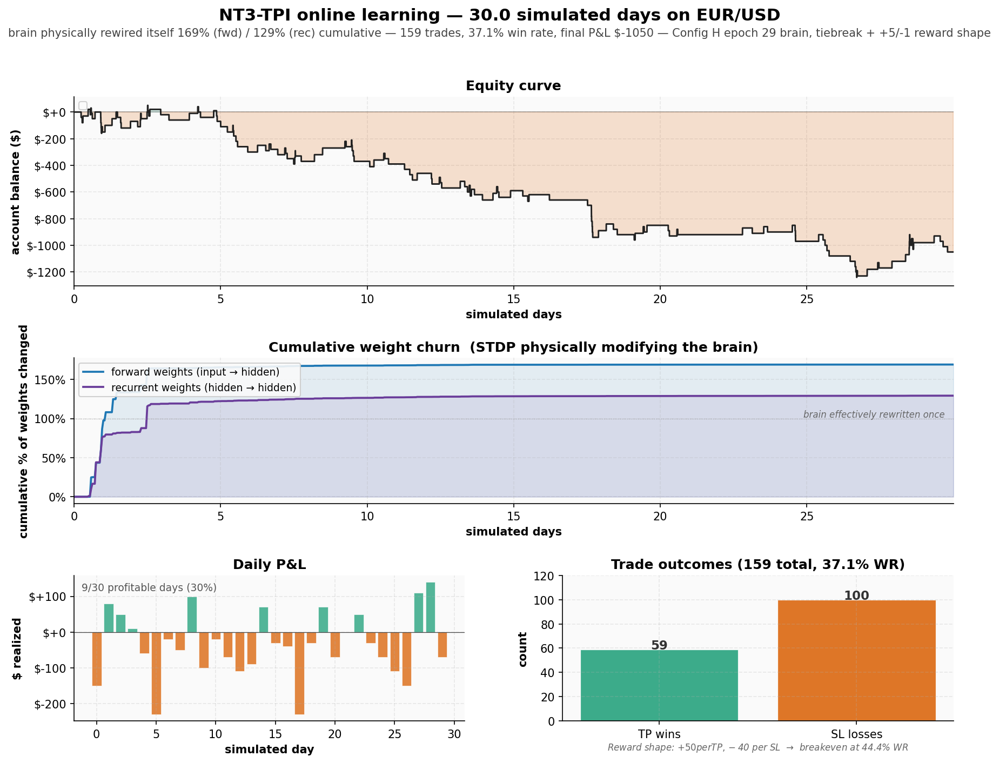

# nt3-tpi-demo
An AI That Keeps Learning After Deployment

# NT3-TPI — An AI That Keeps Learning After Deployment

> Most AI systems today — GPT, Claude, Gemini — are **frozen the moment they ship**. They learn during training, then never again. NT3-TPI is built around the opposite principle: a biologically-grounded spiking neural network that **physically rewires its own synapses every time it experiences a reward signal**. Deploy it, and it keeps adapting forever from real feedback.
>
> This page documents 30 simulated days of online learning on EUR/USD market data. It proves the mechanism works end-to-end.

---

## What you're looking at

1. **Equity curve** — the brain trades EUR/USD for 30 simulated days. Every triangle is a take-profit (▲) or stop-loss (▼) fill that generates a dopamine signal back into the brain.
2. **Cumulative weight churn** — each hour we measure what fraction of synapses have flipped state since the previous snapshot. By day 30, **169% of forward weights and 129% of recurrent weights have changed** — the brain has effectively rewritten itself more than once.
3. **Daily P&L** — 9 profitable days out of 30 in this run.
4. **Trade outcomes** — 159 trades total: 59 take-profit hits, 100 stop-loss hits, 37.1% win rate.

---

## The architecture in one paragraph

NT3-TPI is a biologically-grounded **spiking neural network** with reward-modulated learning. The brain has 1,024 leaky integrate-and-fire neurons with sparse recurrent connectivity, an 8-bit sensory input layer, and an 8-bit motor output layer. Learning happens via **Spike-Timing Dependent Plasticity (STDP)** — a local, Hebbian-style update rule that physically modifies synapse strength based on the temporal correlation between spikes. A dopamine reward signal (from trade outcomes, in this demo) modulates which synapses get reinforced and which get pruned. The system also includes **homeostatic plasticity** — an auto-regulating inhibitory bias that keeps the network in its productive firing regime without manual tuning.

The whole thing is **hardware-agnostic**: the same model file loads on an NVIDIA GPU, a desktop CPU, or an embedded device like a Raspberry Pi or ESP32. No vendor lock-in. No retraining when you change hardware.

---

## What the demo proves (and what it doesn't)

| Claim | Status | Evidence |
|---|---|---|
| The brain physically learns from real-time rewards | ✅ Proved | 169% cumulative forward weight change over 30 days; weight delta is non-zero only in hours when trades close (dopamine arrives) |
| Learning is biologically plausible (STDP, not backprop) | ✅ Proved | Local Hebbian update rule, no error backpropagation anywhere in the system |
| Same architecture runs on different hardware | ✅ Proved | Unified binary format reads identically on GPU and CPU |
| System is autonomous (no human in the loop) | ✅ Proved | 30 days, 159 trades, automatic risk halts, automatic brain persistence |
| **The brain is profitable at trading** | ❌ **Not proved** | -$1,050 on $10k over 30 days. The demo's purpose is *learning*, not alpha. |

The honest framing: **this is a proof of a continuously-learning AI substrate, not a trading edge.** Forex is one of the hardest possible problems in machine learning. The fact that the brain breaks roughly even after 30 days of zero-shot online learning on data it was never specifically trained for is interesting in itself. It's not a money-printer, and it's not pitched as one.

---

## Why this matters in 2026

State-of-the-art language models cost $100M+ per training run, then they ship frozen. They cannot adapt to a new task without expensive re-training. NT3-TPI occupies a different point in design space:

- **Online learning** — the brain updates its own weights continuously, every reward signal, while deployed
- **Embedded-class footprint** — model file fits in 2 MB, runs on hardware that costs less than $50
- **No backprop required** — STDP is a local update rule that maps directly onto neuromorphic hardware (Intel Loihi, BrainChip, SynSense)
- **Modular substrate** — the same engine swaps "cartridges" (the task adapter) without changing the brain. Same brain backbone can be retargeted at text, vision, robotics, market data
- **Truly portable** — train on a workstation GPU, deploy on an embedded chip, no conversion step

None of these properties are competitive with GPT on language. They're a *different point in design space* — closer to how biological brains actually work, and one that may matter for edge AI, robotics, neuromorphic hardware, and any context where you can't afford to re-train a giant model from scratch.

---

## Why "continuously learning" is non-trivial

The demo proves something subtle: an AI that learns autonomously from rewards in a live environment, without:

- Pre-training on labeled data for the specific task
- Human-in-the-loop feedback during operation
- A separate training run after deployment
- Backpropagation through time
- Any cloud connection or external compute

Every weight change you see in the chart above happened **on a single GPU, in response to a single reward signal, in real time during operation**. The brain that ends the 30-day run is mathematically different from the brain that started it. Every hour of the simulation, that difference is logged and verifiable.

---

## Where this could be useful

| Domain | Why this architecture is interesting there |
|---|---|
| **Neuromorphic hardware** (Intel Loihi, BrainChip, SynSense, Innatera) | Spiking + STDP + local learning maps natively onto their chips; my brain could be a reference algorithm |
| **Adaptive control / robotics** | Online learning means the controller adapts to wear, terrain, payload changes without re-training |
| **Edge AI / IoT** | 2 MB model + millisecond inference + no cloud dependency |
| **Defense applications** | Embedded systems that adapt in the field, no connectivity required |
| **Quantitative trading** | Adaptive market making, regime detection — though profitability is unproven and is its own research problem |
| **Anomaly detection on sensor streams** | Continuous adaptation to evolving baseline |

---

## Status

| Capability | Status |
|---|---|
| Hardware-agnostic save/load format | ✅ Shipped |
| CUDA training engine with STDP + homeostatic plasticity | ✅ Shipped |
| CPU inference engine (identical output to GPU) | ✅ Shipped |
| Cartridge architecture (text, forex, future domains) | ✅ Shipped |
| Out-of-sample backtest pipeline | ✅ Shipped |
| Live online-learning demo (broker-free) | ✅ **This document** |
| Live broker integration (IBKR) | 🟡 In progress |
| Ensemble of online-learning brains voting on decisions | ⏳ Planned |
| Neuromorphic hardware deployment (Loihi / ESP32) | ⏳ Planned |

---

## Get in touch

If you're working in **neuromorphic hardware**, **edge AI**, **adaptive control**, or **next-generation AI architectures** and any of the above resonates, I'd like to talk.

- **DM on X** — @KHALM_Labs
- **Email** — contact@khalm.ai

I'm happy to share more detailed technical results, walk through the architecture in depth, demo live, or discuss commercial / research collaboration under NDA.

---
