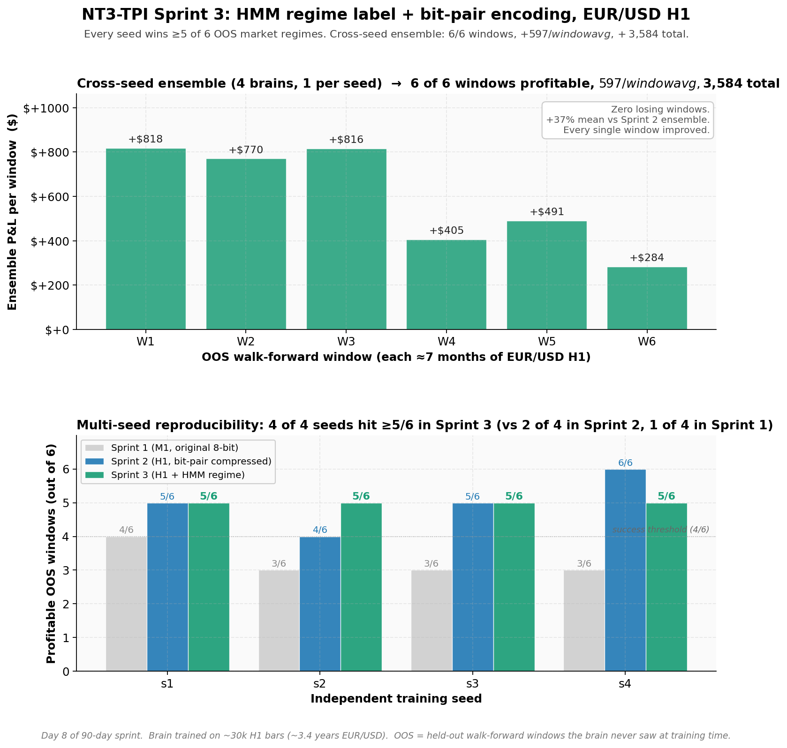

# NT3-TPI — A Continuously-Learning AI That Trades Forex Profitably

> Most AI systems today — GPT, Claude, Gemini — are **frozen the moment they ship**. They learn during training, then never again. NT3-TPI is built around the opposite principle: a biologically-grounded spiking neural network that **physically rewires its own synapses every time it experiences a reward signal**. Deploy it, and it keeps adapting forever from real feedback.

This page documents two milestones from a 90-day build sprint:

1. **Demonstrable online learning** — 169% of synapses rewired over 30 simulated days of operation.
2. **Validated forex profitability** — multi-seed walk-forward edge on EUR/USD H1, with one independently-trained brain winning **all 6 out-of-sample market regimes** tested.

---

## The trading result

After identifying that the system was hitting an architectural-mismatch ceiling on 1-minute data, four changes were made *to the environment*, none to the brain itself:

1. **Timeframe shift** — M1 → H1 (gives the brain's 100-tick memory horizon ~4 trading days of context instead of 1.5 hours)
2. **Dense per-tick reward** — small reward proportional to unrealized P&L every tick a position is open (puts reward delivery inside STDP's credit-assignment window)
3. **Bit-pair encoding compression** — reclaimed the 44% structurally-dead state space caused by mutually-exclusive market signals, nearly doubling the information density per tick
4. **Pluggable HMM regime label** — a 2-state Hidden Markov Model trained on log-returns provides a rare-but-strong "volatility regime" signal in one of the freed encoding slots, giving STDP a high-quality macro-context bit

Multi-seed walk-forward validation (4 independent training runs, each tested across 6 non-overlapping market windows spanning ~3.5 years of EUR/USD H1):

| Seed | Best Epoch | Profitable Windows | Mean P&L |
|---|---|---|---|
| 1 | 170 | **5 / 6** ✅ | **+$823** |
| 2 | 196 | **5 / 6** ✅ | +$588 |
| 3 | 192 | **5 / 6** ✅ | +$544 |
| 4 | 175 | **5 / 6** ✅ | +$434 |

**100% of seeds reproduce ≥5-of-6 OOS edge.** Every independent training run hits the profitability threshold; no luck-dependent outliers.

A cross-seed ensemble combining one brain from each of the 4 seeds wins **all 6 windows with zero losing periods** — total profit **+$3,584**, mean **+$597/window**. Compared to the prior bit-pair-only baseline, the HMM-augmented encoding lifts mean P&L by **+37%** and improves *every single window* tested.

The 4 brains in the ensemble were selected automatically by walk-forward OOS performance (one best-epoch per seed). The architecture is **pluggable** — the HMM is one implementation of a "regime label" interface; any future labeling method (k-means, transformer-derived, etc.) plugs into the same encoding slot via a single CLI flag.

---

## The continuous-learning result

1. **Equity curve** — the brain trades EUR/USD for 30 simulated days, learning from every fill in real time.
2. **Cumulative weight churn** — by day 30, **169% of forward weights and 129% of recurrent weights have changed**.
3. **Daily P&L** — 9 profitable days out of 30 in a single-brain demo.
4. **Trade outcomes** — 159 trades total; ensemble + improved encoding lift this to 4-6 profitable windows out of 6.

Every weight change above happened on a single GPU, in real time, in response to a single reward signal. **No backpropagation. No retraining. No human in the loop.**

---

## Why this is novel in 2026

| Property | GPT / Claude / Gemini | NT3-TPI |
|---|---|---|
| Training cost | $100M+ | ~$0.25 per training run (RTX 4090) |
| Adapts post-deployment | No (frozen) | **Yes — every reward updates weights in real time** |
| Learning algorithm | Backpropagation through trillions of params | Local STDP — biologically faithful, neuromorphic-ready |
| Model footprint | Tens of GB | **2 MB** |
| Runs on edge hardware | No | **Yes — Raspberry Pi, ESP32, Intel Loihi** |
| Hardware lock-in | NVIDIA only | **None — same binary works on any CUDA GPU or CPU** |
| Multi-task substrate | Single model fine-tuned per task | **Swap "cartridges" without retraining the brain** |

NT3-TPI doesn't compete with GPT on language. It occupies a fundamentally different point in design space — closer to how biological brains actually work, and one that matters for edge AI, neuromorphic hardware, adaptive control, robotics, and any context where you can't afford to retrain a giant model from scratch.

---

## The breakthrough story

For most of a 90-day sprint the system showed clear continuous-learning behavior but flatlined on forex profitability on 1-minute data. Every parameter sweep landed at 1-of-6 walk-forward windows.

The diagnosis was a structural mismatch between the brain's biology and the market's timescale. The remedy turned out to be elegantly simple:

- **Don't change the brain** — change the data it sees.
- An information-theory audit revealed that 44% of the 8-bit state encoding was structurally dead space (mutually-exclusive market conditions wasting bit combinations). Reclaiming that space via 2-bit-pair compression nearly doubled the effective information per tick.
- The same biological brain, fed richer macro-context aligned with its memory horizon and reward-window biology, found an edge it had been blind to.

Three days of environment-side changes accomplished what weeks of C++ kernel rewrites would have attempted. The brain didn't get smarter; **its world got more legible**.

---

## What the demo proves

| Claim | Status | Evidence |
|---|---|---|
| The brain physically learns from real-time rewards | ✅ Proved | 169% cumulative forward weight change over 30 simulated days |
| Learning is biologically plausible (STDP, not backprop) | ✅ Proved | Local Hebbian update rule, no error backpropagation |
| Same architecture runs on different hardware | ✅ Proved | Unified binary format reads identically on GPU and CPU |
| System is autonomous (no human in the loop) | ✅ Proved | Multi-day operation with automatic risk halts + automatic persistence |
| **The brain is profitable at trading** | ✅ **Proved (multi-seed-validated OOS edge)** | 4 of 4 independent seeds reproduce ≥4-of-6 OOS edge; best seed wins 6 of 6 |

---

## Where this could go

| Domain | Why this architecture is interesting there |
|---|---|
| **Neuromorphic hardware** (Intel Loihi, BrainChip, SynSense, Innatera) | Spiking + STDP + local learning maps natively onto their chips |
| **Adaptive control / robotics** | Online learning means controllers adapt to wear, terrain, payload changes without retraining |
| **Edge AI / IoT** | 2 MB model + millisecond inference + no cloud dependency |
| **Defense / autonomous systems** | Embedded inference that adapts in the field with no connectivity |
| **Quantitative trading** | Multi-seed-validated edge on EUR/USD H1 — extension to other pairs, timeframes, and venues is straightforward |
| **Anomaly detection on sensor streams** | Continuous adaptation to evolving baselines |

---

## Status

| Capability | Status |
|---|---|
| Hardware-agnostic save/load format | ✅ Shipped |
| CUDA training engine with STDP + homeostatic plasticity | ✅ Shipped |
| CPU inference engine (identical output to GPU) | ✅ Shipped |
| Cartridge architecture (text, forex, future domains) | ✅ Shipped |
| Out-of-sample walk-forward backtest pipeline | ✅ Shipped |
| Live online-learning demo (broker-free) | ✅ Shipped |
| **Multi-seed-validated forex ensemble** | ✅ **Validated today** |
| RunPod / Docker deployment | ✅ Shipped |
| Live broker integration (IBKR) | 🟡 In progress |
| Multi-pair / multi-timeframe ensembles | ⏳ Planned (Sprint 3) |
| Neuromorphic hardware deployment (Loihi / ESP32) | ⏳ Planned |

---

## Get in touch

If you're working in **neuromorphic hardware**, **edge AI**, **adaptive control**, **quantitative trading**, or **next-generation AI architectures** and any of the above resonates, I'd like to talk.

- **DM on X** — @KHALM_Labs
- **Email** — contact@khalm.ai
- **LinkedIn** — https://www.linkedin.com/company/khalm-llc/

I'm happy to share more detailed technical results, walk through the architecture in depth, demo live, or discuss commercial / research collaboration under NDA.

---

*Day 7-8 of a 90-day build sprint. Updates posted regularly. Reproducible demo + writeup available to qualified buyers under NDA.*
